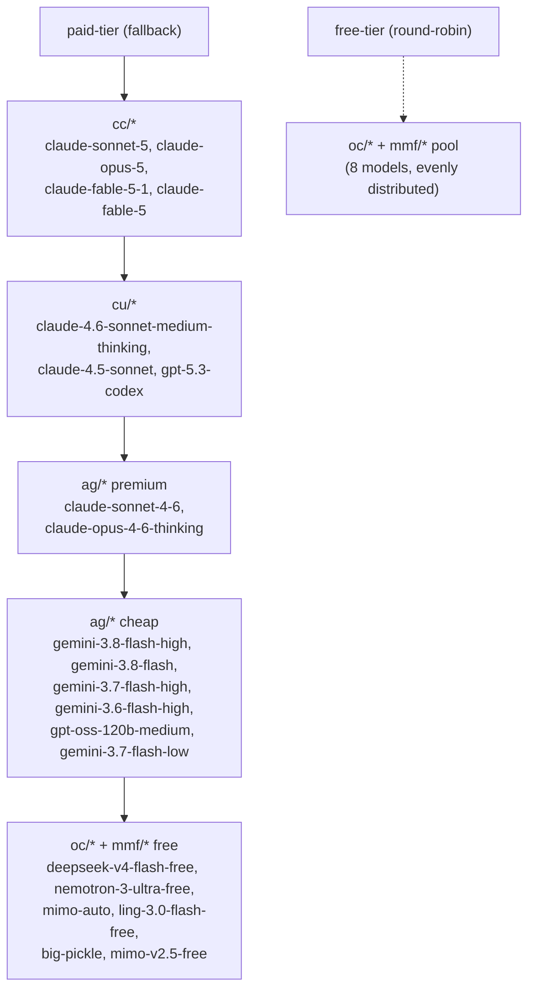

# 9Router Combo Routing

9Router runs locally at `http://localhost:20128` and provides a single OpenAI-compatible endpoint that automatically cascades through providers. Two combos exist: `paid-tier` (fallback cascade) and `free-tier` (round-robin pool).

## Architecture Overview



9Router selects the first model in the chain that can serve the request (fallback strategy). When a model is unavailable (quota exhausted, token expired, error 401/429/500) it falls back to the next model in order. `free-tier` instead round-robins across its pool for load balancing since all models are free/zero-cost.

## Combo Definitions

### `paid-tier` — Unified cascade (fallback strategy)

Single entry point. Priority order: **CC → Cursor (CU) → AG premium → AG cheap → Free (OC/MMF)**.

| Order | Model | Provider | Notes |
|---|---|---|---|
| 1-4 | `cc/claude-sonnet-5`, `cc/claude-opus-5`, `cc/claude-fable-5-1`, `cc/claude-fable-5` | Claude Code | Subscription, try first |
| 5-7 | `cu/claude-4.6-sonnet-medium-thinking`, `cu/claude-4.5-sonnet`, `cu/gpt-5.3-codex` | Cursor | Subscription, second priority |
| 8-9 | `ag/claude-sonnet-4-6`, `ag/claude-opus-4-6-thinking` | Antigravity | Subscription, third priority |
| 10-15 | `ag/gemini-3.8-flash-high`, `ag/gemini-3.8-flash`, `ag/gemini-3.7-flash-high`, `ag/gemini-3.6-flash-high`, `ag/gpt-oss-120b-medium`, `ag/gemini-3.7-flash-low` | Antigravity | Low-cost fallback |
| 16-21 | `oc/deepseek-v4-flash-free`, `oc/nemotron-3-ultra-free`, `mmf/mimo-auto`, `oc/ling-3.0-flash-free`, `oc/big-pickle`, `oc/mimo-v2.5-free` | OpenCode / MimoFree | Zero-downtime safety net |

### `free-tier` — Round-robin pool

Zero-cost models load-balanced evenly, for tasks that don't need premium quality (formatting, quick scripts, or when explicitly avoiding subscription spend).

| Model | Provider |
|---|---|
| `oc/deepseek-v4-flash-free` | OpenCode |
| `oc/nemotron-3-ultra-free` | OpenCode |
| `mmf/mimo-auto` | MimoFree |
| `oc/ling-3.0-flash-free` | OpenCode |
| `oc/big-pickle` | OpenCode |
| `oc/mimo-v2.5-free` | OpenCode |
| `oc/ling-3.0-tiny-free` | OpenCode |
| `oc/muse-spark-1.2-contributor-free` | OpenCode |

## Usage

Point your AI tool at the 9Router gateway:

```
OPENAI_API_BASE=http://localhost:20128/v1
MODEL=paid-tier
```

Or via direct curl:

```bash
curl http://localhost:20128/v1/chat/completions \
  -H "Content-Type: application/json" \
  -H "Authorization: Bearer $NINE_ROUTER_KEY" \
  -d '{
    "model": "paid-tier",
    "messages": [{"role": "user", "content": "Review this Dockerfile for security issues."}]
  }'
```

Use `free-tier` instead of `paid-tier` for zero-cost, round-robin requests.

## Maintenance

### Sync Combos

Run the provisioning script to apply or update the combo definitions at any time:

```bash
python3 dotfiles/9router/sync-combos.py
```

The script is idempotent: it deletes any obsolete combos (legacy `tier1-subscription`, `tier2-cheap`, `tier3-free`, `devsecops-router`), upserts `paid-tier` and `free-tier` to match `TARGET_COMBOS`, and syncs `comboStrategies` (fallback for `paid-tier`, round-robin for `free-tier`) via `/api/settings`.

### Adding Models

Edit `PAID_TIER_MODELS` or `FREE_TIER_MODELS` in `dotfiles/9router/sync-combos.py`, then re-run the sync script. Ordering rule within `paid-tier`: `cc/*` before `cu/*` before `ag/*`.

### Provider Token Expiry

The `cc/` (Claude Code) and `cu/` (Cursor) providers are OAuth-based with periodic expiry. When a provider's token expires, 9Router marks its models unavailable (401 backoff) and the fallback cascade automatically routes to the next tier. Re-authenticate via the 9Router dashboard at `http://localhost:20128` or re-run the provider's import command to restore full priority.
