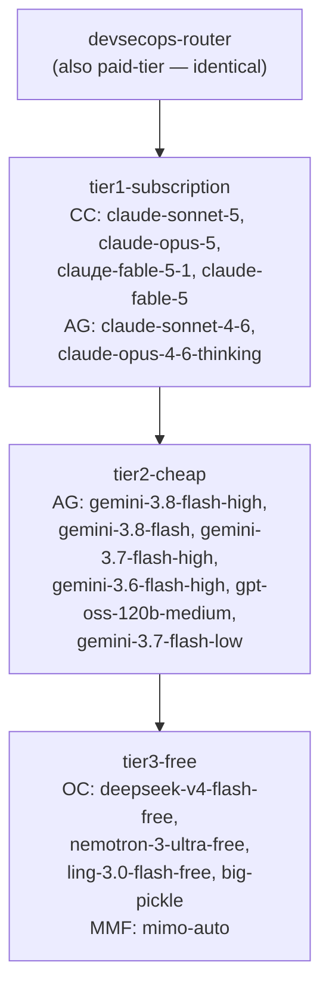

# 9Router 3-Tier AI Routing for DevSecOps

9Router runs locally at `http://localhost:20128` and provides a single OpenAI-compatible endpoint that automatically cascades through providers. This document describes the 3-tier combo structure, model prioritization, and how to use or maintain it.

## Architecture Overview



9Router selects the first model in the chain that can serve the request. When a model is unavailable (quota exhausted, token expired, error 401/429/500) it falls back to the next model in order.

## Tier Definitions

### Tier 1 — `tier1-subscription` (Subscription ROI)
Maximize value of existing subscriptions. Try first, always.

| Model | Provider | Context | Tools |
|---|---|---|---|
| `cc/claude-sonnet-5` | Claude Code (cc) | 1M | Yes |
| `cc/claude-opus-5` | Claude Code (cc) | 1M | Yes |
| `cc/claude-fable-5-1` | Claude Code (cc) | 1M | Yes |
| `cc/claude-fable-5` | Claude Code (cc) | 1M | Yes |
| `ag/claude-sonnet-4-6` | Antigravity (ag) | 1M | Yes |
| `ag/claude-opus-4-6-thinking` | Antigravity (ag) | 200K | Yes |

**Use for:** Complex SAST/DAST vulnerability triage, Helm chart design, Dockerfile multi-stage optimization, Kubernetes RBAC/policy authoring, GKE/EKS security architecture.

### Tier 2 — `tier2-cheap` (Low-Cost Fast)
Cheap per-token models when Tier 1 subscriptions hit rate limits.

| Model | Provider | Context | Tools |
|---|---|---|---|
| `ag/gemini-3.8-flash-high` | Antigravity (ag) | 1M | Yes |
| `ag/gemini-3.8-flash` | Antigravity (ag) | 1M | Yes |
| `ag/gemini-3.7-flash-high` | Antigravity (ag) | 1M | Yes |
| `ag/gemini-3.6-flash-high` | Antigravity (ag) | 1M | Yes |
| `ag/gpt-oss-120b-medium` | Antigravity (ag) | 128K | Yes |
| `ag/gemini-3.7-flash-low` | Antigravity (ag) | 1M | Yes |

**Use for:** CI/CD pipeline YAML debugging, Dockerfile linting fixes, dependency scanning result summarization, code quality report triage, quick IaC snippet generation.

### Tier 3 — `tier3-free` (Zero-Downtime Safety Net)
Zero-cost fallback. Ensures continuous AI access when paid providers are unavailable.

| Model | Provider | Context |
|---|---|---|
| `oc/deepseek-v4-flash-free` | OpenCode (oc) | High |
| `oc/nemotron-3-ultra-free` | OpenCode (oc) | High |
| `mmf/mimo-auto` | MimoFree (mmf) | Medium |
| `oc/ling-3.0-flash-free` | OpenCode (oc) | Medium |
| `oc/big-pickle` | OpenCode (oc) | Medium |
| `oc/mimo-v2.5-free` | OpenCode (oc) | Medium |

**Use for:** Basic code formatting, simple template generation, emergency completions when all paid tiers are locked out.

## Combo Hierarchy & Backward Compatibility

| Combo ID | Purpose | Models |
|---|---|---|
| `devsecops-router` | Primary entry point for DevSecOps tasks | CC → AG-premium → tier2-cheap → tier3-free |
| `paid-tier` | Backward-compatible alias — identical to `devsecops-router` | Same |
| `tier1-subscription` | Subscription-only requests | CC → AG-premium only |
| `tier2-cheap` | Cheap tier only | AG Gemini Flash + GPT-OSS |
| `tier3-free` | Free tier only | OpenCode + Mimo free models |
| `free-tier` | Legacy free combo (pre-existing) | OpenCode + Mimo free models |

`paid-tier` is kept byte-identical to `devsecops-router` so any existing tools or scripts using `model: paid-tier` continue to benefit from the full cascade routing.

## Usage

### Standard DevSecOps Request

Point your AI tool at the 9Router gateway:

```
OPENAI_API_BASE=http://localhost:20128/v1
MODEL=devsecops-router
```

Or via direct curl:

```bash
curl http://localhost:20128/v1/chat/completions \
  -H "Content-Type: application/json" \
  -d '{
    "model": "devsecops-router",
    "messages": [{"role": "user", "content": "Review this Dockerfile for security issues."}]
  }'
```

### Task-to-Tier Selection Guide

| Task | Recommended model |
|---|---|
| SAST finding triage and remediation | `devsecops-router` (will pick Tier 1) |
| Vulnerability root cause analysis | `tier1-subscription` |
| Helm chart / Kubernetes manifest authoring | `devsecops-router` |
| Dockerfile security review | `devsecops-router` |
| Pipeline YAML fix (quick) | `tier2-cheap` |
| Dependency scan result summarization | `tier2-cheap` |
| Code formatting / linting auto-fix | `tier2-cheap` |
| Quick scripts / emergency access | `tier3-free` |

## Maintenance

### Sync Combos

Run the provisioning script to apply or update the combo definitions at any time:

```bash
python3 devsecops/9router/sync-combos.py
```

The script is idempotent: if all combos already match the target definitions, it reports `0 combo(s) created or updated` and exits cleanly.

### Adding Models to a Tier

Edit the `TARGET_COMBOS` dictionary in `devsecops/9router/sync-combos.py`, then re-run the sync script. Follow the ordering rule: `cc/*` entries must precede `ag/*` entries within Tier 1.

### Provider Token Expiry

The `claude` (`cc/`) provider token is OAuth-based with ~8-hour expiry. When expired, 9Router marks its models unavailable (401 backoff) and automatically routes to `ag/` models in Tier 1. Re-authenticate via the 9Router dashboard at `http://localhost:20128` to restore full Tier 1 priority.
